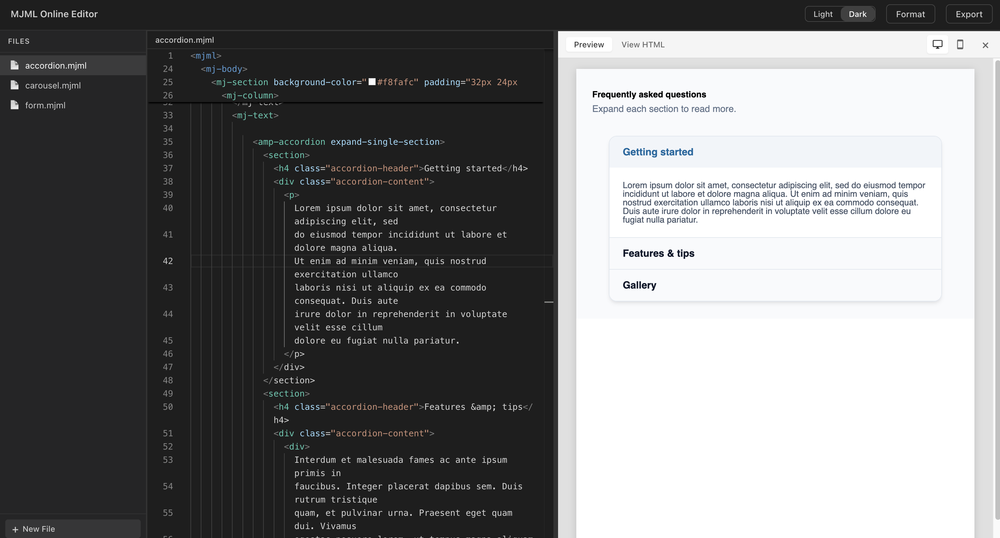

# MJML2AMP Live Demo

MJML online editor with live AMP HTML conversion. Supports multiple files, preview, and export.

## Preview

  

## Features

- Multi-file MJML editing (sidebar file list)
- Live compile to AMP HTML with preview
- Desktop / mobile preview viewport toggle
- Export AMP HTML or MJML source
- MJML syntax highlighting and completion (Monaco Editor)
- Light / dark theme

